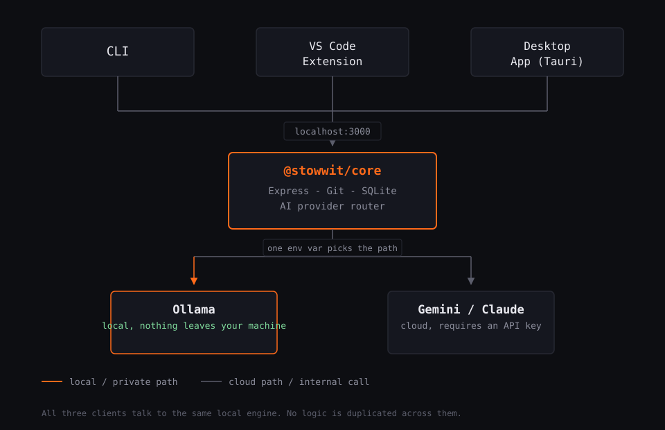

# sto(W)it

[](./LICENSE)
[](https://nodejs.org)
[](../../actions)
[](../../pulls)
[](../../stargazers)

**Your Git stashes, searchable by what they actually do, not by a number that resets every time you pop one.**

## Who this is for

**Probably useful to you if:**
- You context-switch a lot: pausing one branch to firefight something else, coming back days later
- You stash across multiple repos and lose track of which one has what
- You've ever run `git stash list` and had no idea what half the entries were

**Probably not worth the setup if:**
- You already keep clean, short-lived stashes and clear them same-day
- You use a branch-per-task workflow instead of stashing
- You've got 2 or 3 stashes at a time on one repo, tops

This is a quality-of-life tool for a specific, real problem: stash amnesia at scale. It's not a replacement for good git hygiene, and it's not trying to be something every git user needs.

## The problem this solves

`git stash list` gives you `stash@{3}: WIP on main: 8f2a1bc quick fix`. That's fine for a stash you'll pop in ten minutes. It's useless for a stash from three weeks ago, in a repo you haven't touched since, that you're now trying to place among a dozen others.

stowwit reads the actual diff behind each stash, asks an AI what the change does, and gives you a searchable, one-line summary instead of a raw index number.

$ stowwit list
stash@{0} fix: auth redirect loop after logout feature/auth-cleanup
Removes a stale redirect check in the logout handler that sent
users back to the login page even after a successful sign-out.
stash@{1} wip: pagination cursor refactor main
Replaces offset-based pagination with a cursor param. API client
changes are incomplete.


## Why local-first

Point stowwit at [Ollama](https://ollama.com) and every diff, message, and summary stays on your machine. Nothing is sent anywhere. This matters most for teams and codebases where diffs simply can't be pasted into a cloud tool, not just as a personal preference. You can also switch to Gemini or Claude with a single environment variable if you'd rather trade privacy for a stronger model. Details for both are further down.

## How it works



`@stowwit/core` is the only package with real logic. It shells out to `git` to list stashes and pull diffs, stores an indexed summary per stash in a local SQLite file, and routes summarization requests to whichever AI provider you've configured. The CLI, VS Code extension, and desktop app are thin clients that all talk to this one local engine, so nothing is duplicated across surfaces.

## Packages

| Package                     | What it is                                                        |
| ---------------------------- | ------------------------------------------------------------------ |
| `packages/core`               | Node/TS engine: Express API, git integration, SQLite, AI router  |
| `packages/ui`                 | React + Tailwind + Vite frontend, shared by desktop and VS Code   |
| `packages/cli`                | `stowwit` terminal command (Commander.js)                        |
| `packages/vscode-extension`   | Thin VS Code webview host for the shared UI                      |
| `packages/desktop`            | Tauri desktop shell for the shared UI                             |

## Getting started

**Requirements:** Node.js 18.18 or later, git, and, for local AI, [Ollama](https://ollama.com) running with a model pulled.

```bash
git clone https://github.com/yazhnar/stowwit.git
cd stowwit
npm install
```

If this is your first time running `npm install` on this machine, npm may block a handful of native install scripts (`better-sqlite3`, `esbuild`, and a couple of VS Code packaging tools). If you see a warning about that, approve them with:

```bash
npm install-scripts approve --all
```

Then set up your provider (see below), and run the engine and UI together:

```bash
npm run dev
```

Open `http://localhost:5173`, hit **Sync stashes**, and start searching.

### Using the CLI

```bash
npm run build:cli
npm link --workspace=packages/cli
```

If `npm link` fails with an `EACCES` permission error, your global npm folder is owned by a system account rather than your user, which is common on macOS installs that didn't use a version manager. Fix it once, permanently:

```bash
mkdir -p ~/.npm-global
npm config set prefix ~/.npm-global
echo 'export PATH=~/.npm-global/bin:$PATH' >> ~/.zshrc
source ~/.zshrc
npm link --workspace=packages/cli
```

Then:

```bash
stowwit sync
stowwit list
```

## Choosing an AI provider

Set `LLM_PROVIDER` in `packages/core/.env`. Whichever you pick, changes only take effect after restarting `npm run dev`, since environment variables load once at startup.

### Ollama (local, the default)
Nothing leaves your machine. Good for any repo where diffs shouldn't be pasted into a cloud tool.

```bash
ollama pull qwen2.5-coder
```

In `packages/core/.env`:

LLM_PROVIDER=ollama
OLLAMA_HOST=http://localhost:11434
OLLAMA_MODEL=qwen2.5-coder


### Gemini (cloud)
1. Get a key at [aistudio.google.com/apikey](https://aistudio.google.com/apikey).
2. In `packages/core/.env`:

LLM_PROVIDER=gemini
GEMINI_API_KEY=your-key-here
GEMINI_MODEL=gemini-1.5-flash


3. Restart `npm run dev` and sync. Diff content for summarization is sent to Google's API for this provider, not kept local.

### Claude (cloud)
1. Get a key at [console.anthropic.com](https://console.anthropic.com).
2. In `packages/core/.env`:

LLM_PROVIDER=claude
ANTHROPIC_API_KEY=your-key-here
CLAUDE_MODEL=claude-3-5-haiku-latest


3. Restart `npm run dev` and sync. As with Gemini, diff content is sent to Anthropic's API for this provider.

## Contributing

Issues and PRs are welcome. Please open an issue before starting large changes so we can talk through the approach first.

## License

MIT. See [LICENSE](./LICENSE).


